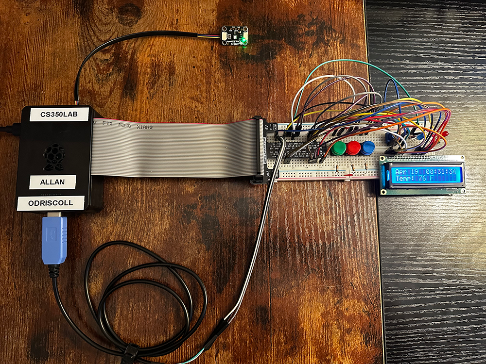
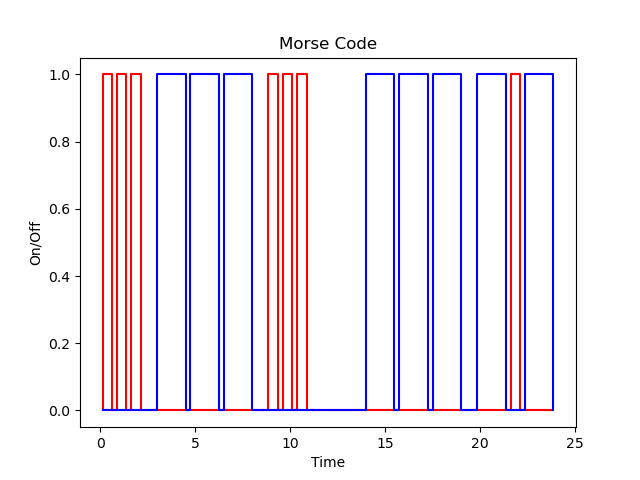

# CS-350 Emerging System Architecture & Technology

```
 _____ _   _  _   _ _   _   _____  _____       _____ _____  _____ 
/  ___| \ | || | | | | | | /  __ \/  ___|     |____ |  ___||  _  |
\ `--.|  \| || |_| | | | | | /  \/\ `--. ______   / /___ \ | |/' |
 `--. \ . ` ||  _  | | | | | |     `--. \______|  \ \   \ \|  /| |
/\__/ / |\  || | | | |_| | | \__/\/\__/ /     .___/ /\__/ /\ |_/ /
\____/\_| \_/\_| |_/\___/   \____/\____/      \____/\____/  \___/ 
```                                                               

## Course Information

|              |                                                                                                                                                                            |
| ------------ | -------------------------------------------------------------------------------------------------------------------------------------------------------------------------- |
| Institution  | Southern New Hampshire University                                                                                                                                          |
| Course       | [CS-350-14554-M01 Emerging Sys Arch & Tech 2025 C-2 (Mar - Apr)](https://learn.snhu.edu/d2l/home/1860290 "CS-350-14554-M01 Emerging Sys Arch & Tech 2025 C-2 (Mar - Apr)") |
| Instructor   | **Roland Morales, M.S.** r.morales3@snhu.edu                                                                                                                               |
| GitHub       | @rmorales3snhuedu                                                                                                                                                          |
| Linked In    |                                                                                                                                                                            |
| Course Dates | 3/03/2025 - 4/27/2025                                                                                                                                                      |
| Status       | Active/Online                                                                                                                                                              |


## Artifacts

| Description                                           | Link                                                                                                                                                                         |
| :---------------------------------------------------- | :--------------------------------------------------------------------------------------------------------------------------------------------------------------------------- |
| Milestone Three Input With Buttons Lab Reflection     | [Allan_ODriscoll_CS350_5_1_Milestone_Three_Input_With_Buttons_Lab_20250405.docx](artifacts/Allan_ODriscoll_CS350_5_1_Milestone_Three_Input_With_Buttons_Lab_20250405.docx)             |
| Milestone Three Input With Buttons Lab Diagram        | [Allan_ODriscoll_CS350_5_1_Milestone_Three_Input_With_Buttons_Lab_20250405.drawio.pdf](artifacts/Allan_ODriscoll_CS350_5_1_Milestone_Three_Input_With_Buttons_Lab_20250405.drawio.pdf) |
| Milestone Three Input With Buttons Lab Python Script  | [Allan_ODriscoll_Milestone3.py](artifacts/Allan_ODriscoll_Milestone3.py)                                                                                                               |
| Final Project Thermostat Lab Report                   | [Allan_ODriscoll_CS350_7_2_Final_Project_Thermostat_20250419.docx](artifacts/Allan_ODriscoll_CS350_7_2_Final_Project_Thermostat_20250419.docx)                                         |
| Final Project Thermostat Lab Diagram                  | [Allan_ODriscoll_CS350_7_2_Final_Project_Thermostat_20250419.drawio.pdf](artifacts/Allan_ODriscoll_CS350_7_2_Final_Project_Thermostat_20250419.drawio.pdf)                             |
| Final Project Thermostat Lab Python Script            | [Allan_ODriscoll_Thermostat.py](artifacts/Allan_ODriscoll_Thermostat.py)                                                                                                               |

## Summarize the project and what problem it was solving.

This course explored various aspects of embedded systems, including microcontrollers and single-board computers like the Raspberry Pi. The final project involved the creation of a thermostat similar to one that you might find in your home. The device consisted of a Raspberry Pi, a temperature sensor, several buttons, an LCD display, and several LED light indicators. The idea was to simulate the functionality of a thermostat to heat and cool the environment based on an active temperature reading and a temperature set point. The requirements for this project included the following:

- The device must have a mechanism to set the mode to either OFF, HEAT, or COOL. This is accomplished with a button (green) that cycles through the three possible modes. This button is connected to the system through GPIO pin 24. The software implements an interrupt-driven state machine that handles the transition between the various modes.
- The device must have a mechanism to define a temperature set point. This is accomplished with two buttons connected to GPIO pins 12 and 25. The first button (red) increases the set point by one degree. The second button (blue) decreases the set point by one degree. When the unit starts, the set point should be initialized to 72 degrees Fahrenheit, but it may be adjusted to the user’s desired temperature using the buttons. Button presses generate interrupt signals that allow the system to react.
- The device must be capable of sensing the ambient temperature in the room. This is accomplished through the use of an AHT20 temperature sensor that communicates using the I2C protocol.
- The device must have a visual indication of the current mode of operation. This is accomplished through the use of two light-emitting diodes. When the system is OFF, both lights will also be off. When the system is in HEAT mode, a red light will be on and will pulse when the system is actively heating. When the system is in COOL mode, a blue light will be on and will pulse when the system is actively cooling.
- The device must have an LCD display that displays the current date and time on one line and alternates between the current temperature reading and the mode plus temperature set point on the second line. The thermostat will use a 1602A LCD for this purpose, along with several additional GPIO pins for communication.
- The device must communicate the mode, temperature reading, and set point with the systems servers. In the prototype, this activity is simulated using several serial ports (i.e., the UART).

The project was delivered as a prototype on a breadboard, along with a video demonstration and a report. Here is an image of the result:



## What did you do particularly well?

The project was designed and built over a set of smaller milestone projects. Milestone three was one of the most interesting projects, which involved the conversion of text to Morse code. This was challenging because I needed to get the timing correct for dots, dashes, letters, and words. This also involved the creation of a state machine that ensured that everything was sequenced correctly. I felt that I did particularly well in this Milestone because I put extra effort into getting the timings correct. A graph of the result for "SOS" and "OK" looked like the following:



## Where could you improve?

I feel that I did pretty well in the project and the related milestones. However, there is always room for improvement. For one thing, I could have spent more time reading and studying the APIs for the Python modules that interact with the external hardware (e.g., gpiozero and adafruit). Having a deeper understanding of these APIs would have allowed me to improve the solution for the end user beyond what was already done. There is so much that can be done with this technology, and I feel that I have barely scratched the surface.

## What tools and/or resources are you adding to your support network?

I've worked with several new Python modules, including gpiozero, adafruit, Statemachine, and Serial. Each of these was interesting and useful in different ways. The Serial module was particularly useful. I never realized how easy it was to write data to a USB-based serial port. In addition, I've been introduced to other interfaces, such as I2C and GPIO. These will be useful for future projects.

## What skills from this project will be particularly transferable to other projects and/or course work?

The ability to integrate hardware with software will be a useful skill that will transfer to many of my future projects. In addition, the soft skills used in designing the system, including the creation of state machine diagrams, will be helpful as well.

## How did you make this project maintainable, readable, and adaptable?

I ensured that I followed industry standards and best practices while writing and documenting the code. The code is easy to follow, object-oriented, and can easily be converted to modules for reuse. THis is something that I will continue to do in all of my future projects.